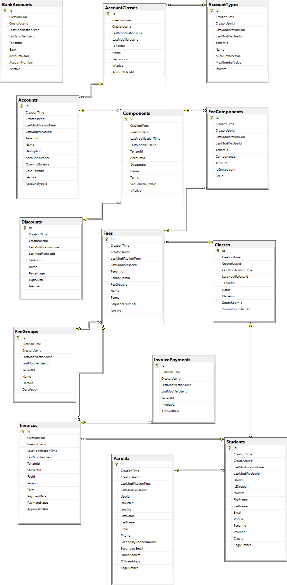

# SCHOOL TRACK Web Application

This is the Web API for SCHOOL TRACK.

High Level Diagram

**Diagram:** High Level Diagram.

Components Diagram

**Diagram:** Components Diagram.

## Proposed Features

These are the functionalities that the system is supposed to have

- ### User Management

- ### Student Management

- ### Teacher Managements

- ### Other Staff Managements

- ### Virtual Classroom

- ### Assesment Management

- ### Facility Management

## Implemented Features

These are the functionalities that have been implemented, this would be updated as we make progress

- ### User Management

- ### Student Management

## Microservices

- ### Authentication Service port:58101
- ### Notification Service port:58102
- ### Facility Service port:58103
- ### Learning Service port:58104
- ### Assessment Service port:58105

**Diagram:** Finance Database Diagram.

